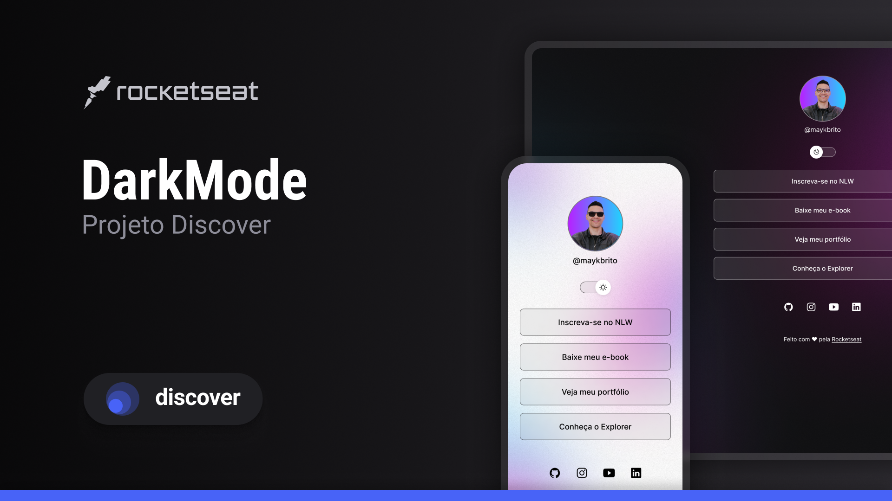

<h1 align="center"> Dark Mode Toggle </h1>

Programa exclusivo e gratuito, promovido pela Rocketseat para ensino de tecnologias WEB.

  <a href="#-tecnologias">Tecnologias</a>&nbsp;&nbsp;&nbsp;|&nbsp;&nbsp;&nbsp;
  <a href="#-projeto">Projeto</a>&nbsp;&nbsp;&nbsp;|&nbsp;&nbsp;&nbsp;
  <a href="#-layout">Layout</a>&nbsp;&nbsp;&nbsp;|&nbsp;&nbsp;&nbsp;
  <a href="#memo-licença">Licença</a>

  

 

  

## 🚀 Tecnologias

Esse projeto foi desenvolvido com as seguintes tecnologias:

- HTML e CSS
- JavaScript
- Git e Github
- Figma

## 💻 Projeto

Este projeto foi desenvolvido durante um curso da Rocketseat. 
O objetivo foi praticar HTML, CSS e JavaScript criando um sistema de alternância entre modo claro e modo escuro.

Este projeto foi desenvolvido para praticar manipulação do DOM, eventos em JavaScript e estilização com CSS.

## 📚 Aprendizados

Durante o desenvolvimento deste projeto eu aprendi:

- Manipulação do DOM com JavaScript
- Alternar classes no CSS
- Estrutura básica de um projeto web
- Uso do Git e GitHub

## 🔖 Layout

Você pode visualizar o layout do projeto através [DESSE LINK](https://www.figma.com/design/zDkNQ2MPxa5rywRmyZqnRX/DevLinks-%E2%80%A2-Projeto-Discover--Community-?node-id=10-620&p=f&t=u52kq9YSvPRr50cv-0). É necessário ter conta no [Figma](https://figma.com) para acessá-lo.

## :memo: Licença

Esse projeto está sob a licença MIT.

---

Desenvolvido por Brendpw durante estudos com a Rocketseat 🚀
